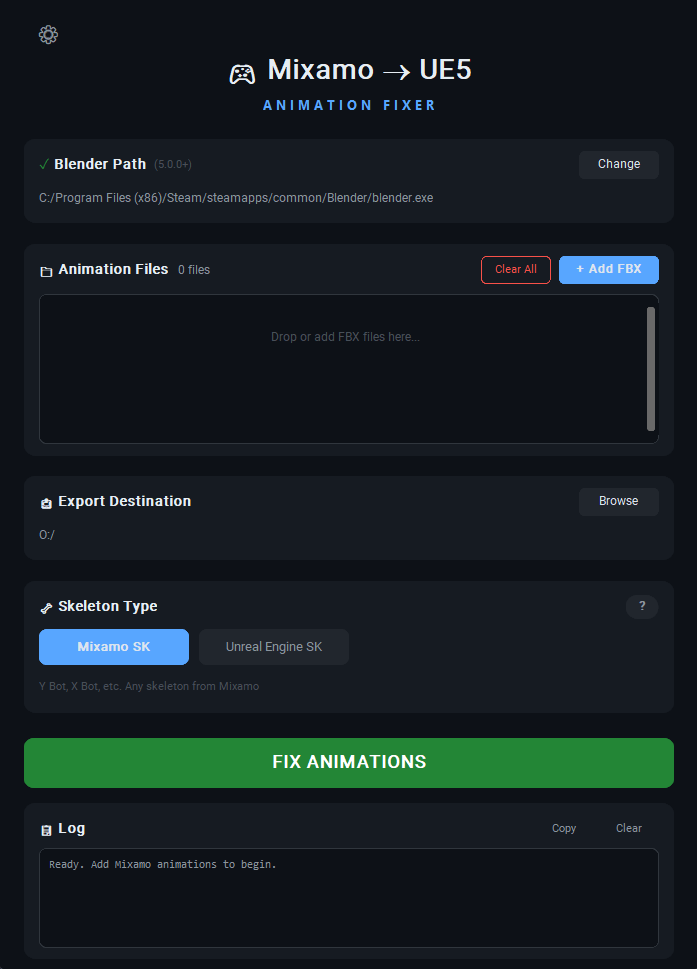

# 🎮 Mixamo Animation Fixer for UE5

[](https://python.org)
[](https://blender.org)
[](https://www.microsoft.com/windows)
[](LICENSE)

A GUI tool that fixes Mixamo animations for Unreal Engine 5 skeletal meshes. Supports both standard Mixamo skeletons and UE5 mannequins (Manny/Quinn).



---

## 🚀 Quick Start

### Option 1: Download Release (Recommended)

1. Go to [Releases](https://github.com/Schizogonia/mixamo-ue-fix/releases)
2. Download the latest `.exe` installer
3. Run the application
4. Set the path to Blender 5.0+
5. Drag & drop your FBX files and click **FIX ANIMATIONS**
6. Done! Now you can import your fixed animations to UE

### Option 2: Run from Source

```bash
git clone https://github.com/Schizogonia/mixamo-ue-fix.git
cd mixamo-ue-fix
pip install -r requirements.txt
python launcher.py
```
## 🦴 Skeleton Types

### Mixamo SK

Skeleton downloaded from Mixamo (Y Bot, X Bot, etc.).
This works for any skeleton without a root bone and with a Hips bone.

**What the code does:**

1. Finds the Hips bone
2. Collects world positions of Hips for each frame
3. Transfers XY motion from Hips to the Armature object (root motion)
4. Removes XY from the Hips bone — keeps only Z
5. Renames the top-level object to root

**How to get animations:**

Go to Mixamo and download the animation "With Skin", without uploading a skeleton at all, or use any Mixamo skeleton. Just don't use a skeleton with a root bone (Manny / Quinn / etc).

---

### Unreal Engine SK

Skeleton from Unreal Engine (Quinn, Manny, etc.).
Has root and pelvis bones in the hierarchy.
When uploaded to Mixamo, the animation is applied to the object, leaving the root and pelvis bones without movement. After processing, the resulting animation is usually closer to the original Mixamo animation than what you would achieve by downloading and fixing a Mixamo skeleton and then retargeting inside Unreal Engine.

**What the code does:**

1. Creates a duplicate armature as a data source
2. Removes animation from the Armature object
3. Creates an Empty that copies the XY position of the pelvis
4. Sets up constraints: root → Empty, children → duplicate
5. Bakes animation into keyframes
6. Removes temporary objects

**How to get animations:**

Export the Quinn/Manny skeleton from UE, upload to Mixamo for auto-rigging, download the animation "Without Skin", and after this app fixes it, import it back to UE, choosing your original skeleton as the skeletal mesh.

---

## 📋 Requirements

| Dependency | Version | Notes |
|------------|---------|-------|
| Blender | 5.0+ | Required for animation processing |
| Windows | 10/11 | Only Windows is supported |
| Python | 3.11+ | Only if running from source |

---

## 📁 Project Structure

```
mixamo-ue-fix/
├── launcher.py         # GUI application
├── worker.py           # Blender processing script
├── config.json         # Settings (paths, window size, colors)
├── logo_inv.ico        # Application icon
├── build.spec          # PyInstaller build configuration
├── installer.iss       # Inno Setup installer script
├── requirements.txt    # pip dependencies
├── pyproject.toml      # Poetry configuration
├── poetry.lock         # Poetry lock file
├── .gitignore          # Git ignore rules
└── Fixed_Animations/   # Default output folder
```

---

## 🎨 Configuration

Click the ⚙ button in the app to open `config.json`:

```json
{
  "blender_path": "C:/Program Files/Blender Foundation/Blender 5.0/blender.exe",
  "output_dir": "C:/path/to/output",
  "window": {
    "width": 700,
    "height": 810
  },
  "theme": {
    "bg_dark": "#0d1117",
    "accent": "#58a6ff",
    "success": "#238636",
    "danger": "#f85149"
  }
}
```

---

## 🔨 Building from Source

To build the standalone executable:

```bash
pip install pyinstaller
pyinstaller build.spec
```

The executable will be created in the `dist/` folder.

---

## 📄 License

MIT License — feel free to use and modify.
